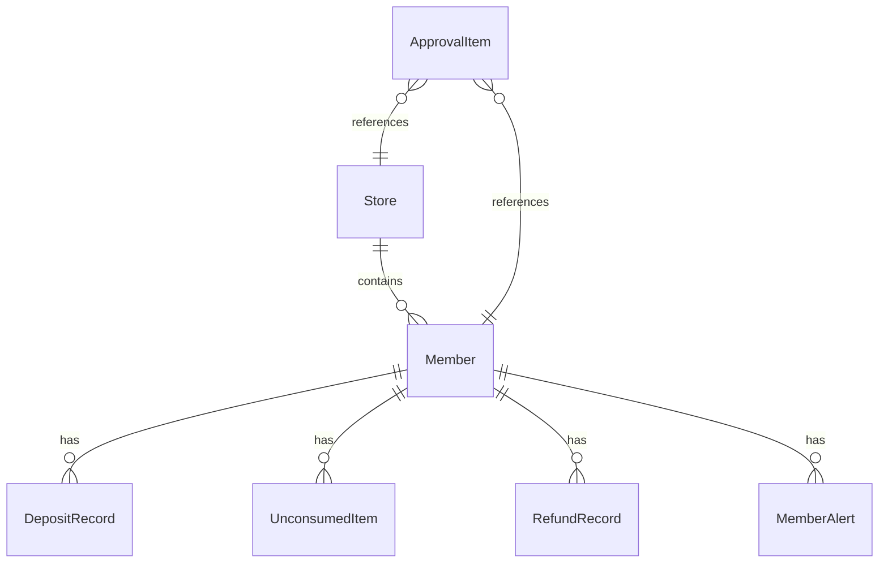

## 1. 架构设计

```mermaid
flowchart TD
    "前端 React App" --> "Mock数据层"
    "前端 React App" --> "Zustand状态管理"
    "Zustand状态管理" --> "本地存储(重点观察名单等)"
    "前端 React App" --> "Recharts图表"
    "前端 React App" --> "Web Speech API(语音备注)"
```

本项目为纯前端项目，使用Mock数据模拟后端API，所有数据操作在前端完成。

## 2. 技术说明

- 前端框架：React 18 + TypeScript
- 构建工具：Vite
- 样式方案：Tailwind CSS 3
- 状态管理：Zustand
- 图表库：Recharts
- 图标库：Lucide React
- 路由：React Router DOM v6
- 语音备注：Web Speech API（浏览器原生）
- 数据层：Mock数据（模拟API响应）
- 后端：无（纯前端演示项目）

## 3. 路由定义

| 路由 | 用途 |
|------|------|
| / | 今日概览（默认首页） |
| /stores | 门店排行 |
| /alerts | 异常会员 |
| /approvals | 审批消息 |
| /member/:id | 会员详情 |
| /store/:id | 门店详情 |

## 4. API定义

无后端API，使用Mock数据。核心数据结构如下：

```typescript
interface OverviewData {
  totalBalance: number
  todayNewDeposit: number
  todayConsumption: number
  pendingRefund: number
  balanceYoY: number
  depositYoY: number
  consumptionYoY: number
  refundYoY: number
  consumptionTrend: { date: string; value: number }[]
  riskSignals: RiskSignal[]
}

type RiskLevel = 'red' | 'yellow' | 'green'

interface RiskSignal {
  level: RiskLevel
  message: string
  link?: string
}

interface Store {
  id: string
  name: string
  region: string
  depositGrowth: number
  consumptionRate: number
  deviation: number
  riskLevel: RiskLevel
  abnormalMemberCount: number
  activityDepositRatio: number
  isWatched: boolean
}

interface Member {
  id: string
  name: string
  phone: string
  riskLevel: RiskLevel
  totalDeposit: number
  totalConsumed: number
  remainingBalance: number
  consultant: string
  alerts: MemberAlert[]
  depositTimeline: DepositRecord[]
  activities: ActivityRecord[]
  unconsumedItems: UnconsumedItem[]
  refundHistory: RefundRecord[]
}

interface MemberAlert {
  type: 'spike_deposit' | 'consultant_concentrated' | 'frequent_split'
  description: string
  time: string
}

interface DepositRecord {
  id: string
  time: string
  amount: number
  activity?: string
  operator: string
  type: 'normal' | 'activity' | 'gift'
}

interface UnconsumedItem {
  id: string
  name: string
  amount: number
  depositTime: string
}

interface RefundRecord {
  id: string
  time: string
  amount: number
  reason: string
  approver: string
}

interface ApprovalItem {
  id: string
  type: 'excess_gift' | 'special_refund' | 'account_unfreeze'
  title: string
  memberName: string
  memberPhone: string
  amount: number
  storeName: string
  applicant: string
  applyTime: string
  urgency: 'high' | 'medium' | 'low'
  status: 'pending' | 'approved' | 'rejected'
  reason?: string
  voiceNote?: string
  processedTime?: string
  processor?: string
}

interface ApprovalReason {
  id: string
  label: string
  type: 'excess_gift' | 'special_refund' | 'account_unfreeze'
}
```

## 5. 服务器架构图

无后端服务器，纯前端项目。

## 6. 数据模型

### 6.1 数据模型定义



### 6.2 数据定义

使用TypeScript接口定义数据结构（见上方API定义），Mock数据内嵌在前端代码中。
